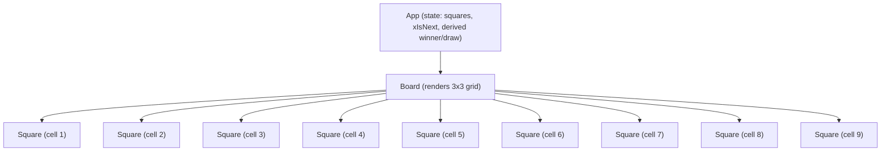

# Tic Tac Toe React Frontend – Architecture

## System Context and Scope
This application is a client-side React 18 web app built with Create React App. It has no backend services, no persistence layer, and no external data integrations. All state and logic reside in the browser session memory. The scope includes:
- UI rendering of a 3x3 Tic Tac Toe board.
- Local state management for moves, turns, and outcomes (win/draw).
- Basic accessibility semantics for status and interactive elements.
- Theming via the Ocean Professional style.

Out of scope:
- Authentication/authorization, identity, audit logging, and electronic signatures.
- Network APIs, databases, or distributed components.

## UI Architecture
The UI consists of three primary components and a local helper function:
- App (src/App.js): Top-level component that owns game state and orchestrates gameplay.
- Board (src/components/Board.jsx): Renders a 3x3 grid of Square components with proper roles and props.
- Square (src/components/Square.jsx): A button representing a single cell; shows X/O when set and can be disabled.
- calculateWinner (in App.js): Pure function to evaluate winning lines.

Component hierarchy (text diagram):
- App
  - Board
    - Square x 9

State flows:
- App maintains:
  - squares: Array(9). Values: 'X', 'O', or null.
  - xIsNext: boolean indicating current player.
- App computes:
  - winner via calculateWinner(squares).
  - isDraw via squares.every(Boolean) && !winner.
  - currentPlayer derived from xIsNext.
- App passes props to Board:
  - squares, onSquareClick(index), disabled (winner || isDraw).
- Board renders 9 Squares with:
  - value (from squares[index]).
  - onClick that forwards index to App handler.
  - disabled when board is disabled or cell has a value.
- Square is a button; it renders a mark span. It forwards accessible attributes from Board.

Key logic excerpt (see src/App.js):
- handleSquareClick: Ignores clicks if winner exists or square already filled; otherwise sets current mark and toggles turn.
- handleRestart: Resets state to initial values.
- calculateWinner: Checks 8 winning lines; returns 'X' or 'O' or null.

## Design and Theming (Ocean Professional)
The design uses light backgrounds with clean typography and subtle depth:
- Theme variables defined in src/styles/theme.css (colors, radii, shadows, transitions).
- App styling in src/index.css imports theme.css and applies:
  - Card-like container with subtle shadows and rounded corners.
  - Grid layout for the board (3x3) using CSS grid and gap.
  - Buttons with gradient accents and hover states.
  - Large, legible “X” and “O” marks with accent coloring (primary for X, sky accent for O).

The aesthetic aligns to the “Ocean Professional” theme: primary #3b82f6, secondary #64748b, success #06b6d4, error #EF4444, on a white surface and neutral background.

## Data and State Management
- Data model:
  - squares: Array(9) of ('X'|'O'|null).
  - xIsNext: boolean.
- Derived state:
  - winner: 'X'|'O'|null from calculateWinner.
  - isDraw: boolean when all squares filled and no winner.
  - currentPlayer: 'X' or 'O' derived from xIsNext.
- Operations:
  - Place Mark: Update squares[index] with currentPlayer if allowed.
  - Toggle Turn: Flip xIsNext.
  - Reset: Set squares to all null and xIsNext to true.
- No persistence or external I/O. All logic is synchronous and deterministic.

## Accessibility and i18n Considerations
Accessibility:
- Status paragraph has role="status" and aria-live="polite" to announce changes.
- Board uses role="grid"; cells are native buttons enabling keyboard operability by default.
- Each Square exposes an aria-label indicating its index and occupancy (“Cell N empty/occupied by X|O”).
- Font sizes are responsive via clamp; colors target sufficient contrast under WCAG AA.

Internationalization (i18n):
- Labels and strings are English only. No i18n framework is included. Given minimal string set and scope, i18n is deemed out-of-scope but can be added later by extracting labels into a messages map and wrapping in an i18n provider.

## Error Handling and Logging
- Error handling strategy for UI-only logic:
  - Invalid interactions (clicking filled squares or clicking after game end) are ignored by early returns in handleSquareClick.
  - There is no network or async I/O; thus, no retry or error boundary is necessary for external failures.
- Logging:
  - No telemetry or console logging is required in scope. Developers can enable debug logs locally if needed.

## Testing Strategy (unit, integration, validation)
- Unit:
  - Validate calculateWinner behavior via state transitions covered in App.test.js.
  - Validate App’s state updates for moves, turn flips, and restart.
- Integration:
  - UI interaction tests simulate sequences: first move, winning lines, draw, and restart, using @testing-library/react (see src/App.test.js).
- Validation:
  - Acceptance criteria-based testing: Confirm status messages, disabled states post outcome, and reset.
  - Accessibility spot checks: Roles and aria-live verified through queries and code review.

Coverage target:
- ≥ 80% lines coverage for src/. Enforced via CI or local reporting under CRA defaults.

## GxP Compliance Mapping (requirements to implementation/tests)
Given UI-only scope with transient state and no persistence:
- Data Integrity (ALCOA+):
  - Attributable/Enduring/Available: Not applicable as no users or persistent records. Rationale documented in PRD.
  - Accurate/Complete/Consistent: Ensured through deterministic UI logic and tests verifying winner/draw correctness and move rules.
  - Legible: Code readability via clear component structure, PropTypes, and ESLint rules.
  - Contemporaneous/Original: No audit trail required; no recordkeeping occurs.
- Access Controls:
  - Not applicable; no user roles or sensitive data. Scope rationale documented.
- Electronic Signatures:
  - Not applicable; no critical operations or records.
- Validation Controls:
  - Input validation equivalent in UI: ignore invalid moves (filled squares, post-game clicks). Verified through tests.
- Error Handling:
  - Graceful handling of invalid interactions; no crashes during gameplay sequences as covered by tests.

Traceability highlights:
- Requirements (US-001..US-004) → Implementation (App.js, Board.jsx, Square.jsx) → Tests (App.test.js).
- Accessibility requirements → Implementation in App.js/Board.jsx/Square.jsx.

## Release Gate Checklist
- Functional:
  - All acceptance criteria for US-001..US-004 pass in automated tests.
  - Restart resets state; winner/draw detection accurate.
- Quality:
  - Unit coverage ≥ 80% for src/.
  - Integration tests pass locally/CI.
  - ESLint passes with zero errors.
- Accessibility:
  - role="status" with aria-live on status.
  - role="grid" and button semantics for cells present.
- Compliance:
  - PRD and Architecture include scope rationale for GxP and validation.
  - Traceability matrix exists and is current.
- Documentation:
  - Readme and code comments up-to-date.
  - Theme variables defined and referenced from theme.css.
- Operational:
  - CRA build succeeds without warnings that block release.

## Component Hierarchy Diagram

## Source References
- src/App.js: Application logic, state management, calculateWinner, accessibility for status, restart control.
- src/components/Board.jsx: Grid rendering with role="grid", Square composition, disabled behavior.
- src/components/Square.jsx: Button-based cells, mark rendering, PropTypes, accessible labels.
- src/index.css and src/styles/theme.css: Ocean Professional theme variables and component styling.
- src/App.test.js: Interaction tests covering initial state, turn flips, win, draw, and restart.
